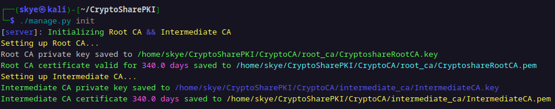
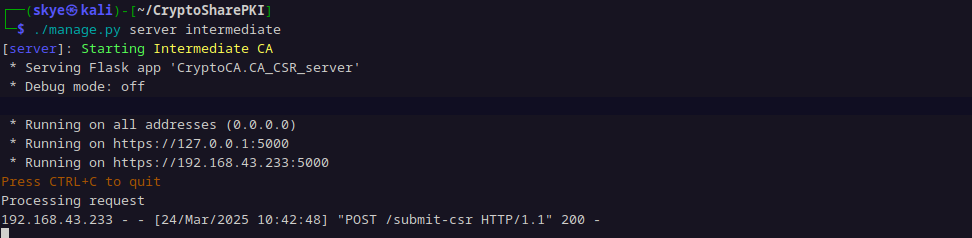
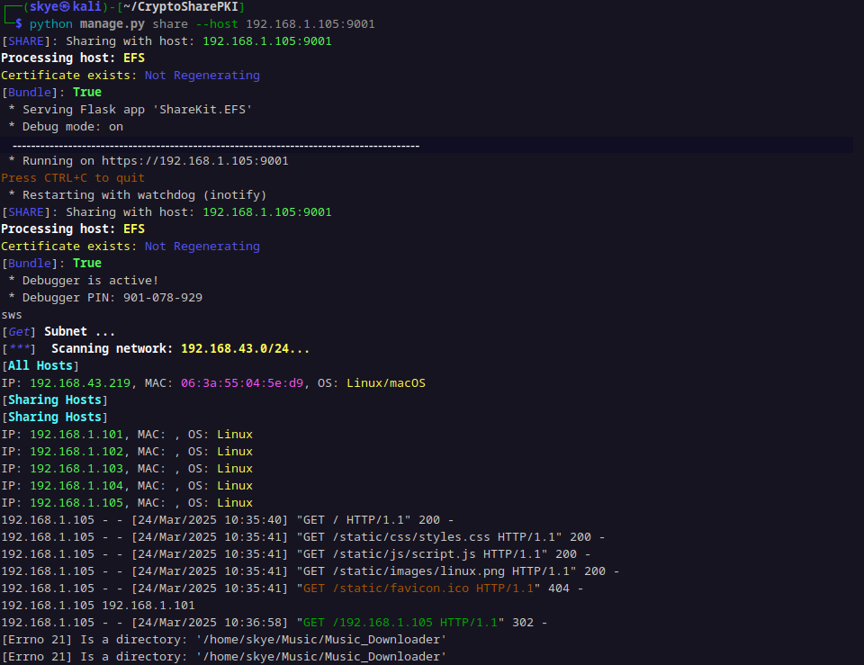
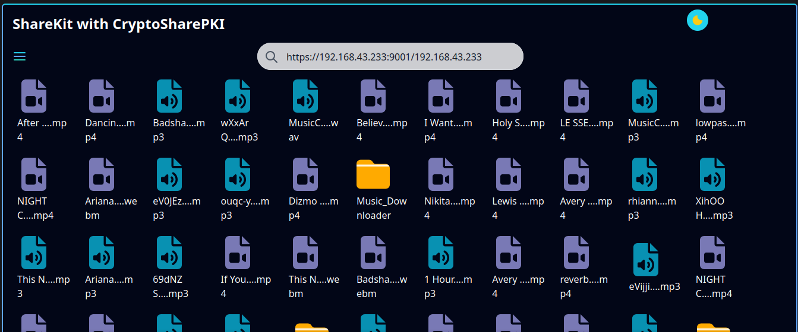
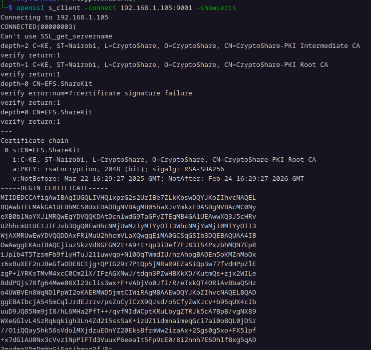

---

# **Dynamic PKI-Enabled File Encryption System**

## **Overview**
This project implements a
1. **PKI -> Public Key infrastructure**
2. **PKI-enabled file encryption and decryption system** with automated directory monitoring and **file sharing** capabilities. The system is designed to facilitate secure file sharing, authentication, and encryption in a networked environment, using certificates issued by a Root CA and signed by an Intermediate CA.

---

## **Features**
1. **PKI Framework**:
   - Root CA initializes the chain of trust and generates Intermediate CA credentials.
   - Intermediate CA acts as the signing authority for host certificates.

2. **Host Certificates**:
   - Hosts generate unique certificate signing requests (CSRs) and obtain signed certificates from the Intermediate CA.
   - Signed certificates are installed with the Intermediate CA and Root CA certificates to complete the chain of trust.
   - During this process a ``PKCS#12`` (**.p12**) is created and stored in th ```userKit/host_certs``` dir, this certificates is to be imported to a browser to enable server access.

3. **File Encryption and Decryption**:
   - Encrypts files dynamically using public keys from a shared public key store.
   - Decrypts encrypted files when accessed and re-encrypts them after closure.

4. **File Sharing**:
   - Hosts can share files over the network using a lightweight file-sharing server.
   - Includes support for file downloads within the same network.
   - The server is protected behide the PKI framework such that only the certified entities can access it.
   - User can specify the file of folder to share in `SharKit-conf.ini`

---

#### **Files and Structure**
```bash
CryptoSharePKI
├── CryptoCA
│   ├── CA_CSR_server.py
│   ├── config.ini
│   ├── intermediate_ca
│   ├── IntermediateCA_self_monitor.py
│   ├── pki_certs
│   ├── root_ca
│   └── RootCA.py
├── docs
│   ├── auto_cert_gen_unix.png
│   ├── auto_cert_gen_win.png
│   ├── autRootcr_unix.png
│   ├── certficate_verified.png
│   ├── cert_gen_unix.png
│   ├── cert_info1.png
│   ├── cert_info2.png
│   ├── cert_info.png
│   ├── chromium_cert_import.png
│   ├── chromium_cert_request.png
│   ├── demo.mkv
│   ├── directWIN.png
│   ├── doc.txt
│   ├── evolution-PGP-public key.png
│   ├── File sharing _ Upload and Download.pdf
│   ├── firefox_cert_request.png
│   ├── gurnicon.png
│   ├── importer_unix.png
│   ├── import_unix_sucess.png
│   ├── PRIVIlege_windows.png
│   ├── README.docx
│   ├── root_ver_fail.png
│   ├── shared-dark.png
│   ├── share_files_dark.png
│   ├── share_files_light.png
│   ├── sm-create-namespaces.png
│   ├── trust_verify_true.png
│   ├── verifyCATrust_unix.png
│   ├── verify_seccess.png
│   └── win_privilges.png
├── gunicorn.conf.py
├── host_importer.py
├── installer.py
├── manage.py
├── README.md
├── requirements.txt
├── setup.py
├── ShareKit
│   ├── App
│   ├── device_info.py
│   ├── EFS.py
│   ├── ensure_admin.py
│   ├── __init__.py
│   ├── net_scanner.py
│   ├── read_config.py
│   ├── server_cert.py
│   └── sharekit-conf.ini
├── simulate.py
├── simulations
│   ├── cleanup_netns.sh
│   └── setup_netns.sh
├── tests
│   ├── AutoCertsGen.py
│   ├── host_cert_importer.py
│   ├── host_cert_monitor.py
│   ├── hosts.json
│   ├── opensslSetup.py
│   ├── PKI@Pro.zip.asc
│   └── scp_distribute_certificates.py
├── userKit
│   ├── AutoCertsGen.py
│   ├── config.ini
│   ├── export2p12.py
│   ├── hostCertMonitor.py
│   ├── host_certs
│   ├── opensslSetup.py
│   ├── PKI_colors.py
│   ├── requirements.txt
│   ├── src
│   └── verifyCATrust.py
└── utils
    ├── colors.py
    └── __init__.py
    ```
## Project Description
- The`userKit` directory contains user logic files.
- The`CryptoCA` directory contains all ``CA`` implementation files.
- The`ShareKit` directory contains file sharing server implementation.
- The`utils` directory contains common dependency logic files.
- The`simulations` directory contains Namespace simulation logic for linux environment, which simulates the file sharing between clients.
- The `manage.py` implements simple CLI acess to all the project operation for: **CA**, **User**, && **File sharing**.

## **Setup Instructions**
`**A**`. **clone The project**.
```bash
git clone https://github.com/skye-cyber/CryptoSharePKI
```

**B**.
### **1. Root CA Setup**
1. Transfer the Root CA files to the server machine (Windows/Linux).
2. Install the required libraries:
   ```shell
   python -m pip install -r requirements.txt
   ```
   or simply:
   ```shell
   pip install -r requirements.txt
   ```
  or sometimes on windows:
    ```shell
   py -m pip install -r requirements.txt
   ```
3. Initialize the Root CA:
   ```shell
   python manage.py init
   ```
   or on linux:
    ```shell
   ./manage.py init
   ```
   This script generates the Root CA keys and sets up the Intermediate CA.


---
4. Start the Intermediate CA server:
   ```shell
   python manage.py server intermediate
   ```
   - This starts a PKI server where hosts/users can connect to obtain, sign, or update their certificates.

---

**C**.
### **2. Host/User Setup**

#### **Steps**
1. Transfer the host files to the user's computer.
2. Install the required libraries:
   ```shell
   python -m pip install -r requirements.txt
   ```
   or simply:
   ```shell
   pip install -r requirements.txt
   ```

3. Generate Certificates:
   ```shell
   python manage.py setup
   ```
   - This script generates the host's unique certificate and requests signing from the Intermediate CA.
   - The Intermediate CA:
     - Signs the certificate.
     - Provides its own certificate and that of the Root CA.
   - These certificates are installed locally, completing the chain of trust.

4. Verify Certificates:
   - Once installed, the host verifies the authenticity of the Intermediate CA certificate.


---

**D**.
### **3. File Sharing**

#### **Steps**
1. Start the File Sharing Server:
    ```shell
   python manage.py share
   ```

2. Configure the Server:
   - Open the `.ini` file in ShareKit and:
     - Set up folder-sharing options.
     - Define the download location.

3. Access the File Sharing Server:
   - Members of the same network can:
     - Access the server using its IP address.
     - Download files directly.
     - Upload files to the host.
     **THIS IS ONLY IF THEY CAN CORRECTLY AUTHENTICATE TO THE INTERMEDIATE AND ROOT CA**

 
---

---

---

**NOT YET COMPLETED**
|-->
## **Advanced Usage**

### **File Encryption and Decryption**
1. **Encrypt Files**:
   - Automatically encrypts files in the monitored directory.
   - Uses the recipient's public key, fetched dynamically from the public key store.

2. **Decrypt Files**:
   - Decrypts files when accessed, saving a temporary plaintext version.
   - Opens the decrypted file using the system's default application.
   - Re-encrypts the file after closure.

3. **File Monitoring**:
   - Uses the `watchdog` library to monitor file creation and modification events.

### **Public Key Store**
- The public key store (`PUBLIC_KEY_STORE`) contains public keys for all machines in the network.
- Public keys are named after their respective machine identities (e.g., `machine_name.pem`).

---

## **Directory Monitoring Setup**

### **Configuration**
Edit the following variables in the script as needed:
- **`WATCHED_DIR`**:
  - Path to the monitored directory (e.g., `/mnt/shared_folder` or `\\server_ip\shared_folder`).
- **`PUBLIC_KEY_STORE`**:
  - Path to the directory containing public keys.
- **`PRIVATE_KEY_PATH`**:
  - Path to the host's private key file.
- **`ENCRYPTED_EXTENSION`**:
  - File extension for encrypted files (default: `.enc`).

### **Run the Script**
1. Mount the shared folder:
   - **Unix/Linux**:
     ```shell
     sudo mount -t cifs -o username=<username>,password=<password> //<server>/<shared_folder> /mnt/shared_folder
     ```
   - **Windows**:
     ```cmd
     net use X: \\<server>\<shared_folder> /user:<username> <password>
     ```
2. Start monitoring:
   ```shell
   python PKI_crypto.py monitor
   ```

---

## **Logging**

### **Log File**
- All activities are logged in `file_activity.log`:
  - Encryption and decryption events.
  - Errors and warnings.

### **Sample Log Output**
```plaintext
2024-11-23 14:10:00 - INFO - Watching directory: /mnt/shared_folder
2024-11-23 14:12:01 - INFO - File encrypted: /mnt/shared_folder/document.txt.enc
2024-11-23 14:14:45 - INFO - Decrypted file saved temporarily at /tmp/document.txt
2024-11-23 14:15:12 - INFO - Temporary file /tmp/document.txt deleted securely.
2024-11-23 14:15:13 - INFO - File encrypted: /mnt/shared_folder/document.txt.enc
```
|<--
---

## **Troubleshooting**
### **SSL secure connection failure**
## Check server certificate
```bash
openssl s_client -connect <target server ip>:9001 -showcerts
```

---

### **File Not Encrypted**
- Ensure the file doesn't already have the `.enc` extension.
- Verify the public key exists in the `PUBLIC_KEY_STORE`.

### **Certificate Issues**
- Verify the chain of trust by checking the Root CA and Intermediate CA certificates.
- Ensure the Intermediate CA server is running and accessible.

### **Shared Folder Not Accessible**
- Check network connectivity and permissions.
- Ensure the shared folder is mounted properly.

---

## **Future Improvements**
1. **Key Management**:
   - Automate updates to the public key store via an API or centralized server.

2. **Access Control**:
   - Implement authentication for shared folder access.
   - Restrict decryption based on roles.

3. **File Integrity**:
   - Add digital signatures to verify file authenticity before decryption.

4. **GUI**:
   - Develop a graphical interface for easier management of encryption and file sharing.

5. **File Encryption** 
- complete implementation of a robust and reliable encryption.

---

## **Contributors**
- **[Wambua]** – Project Lead

---
